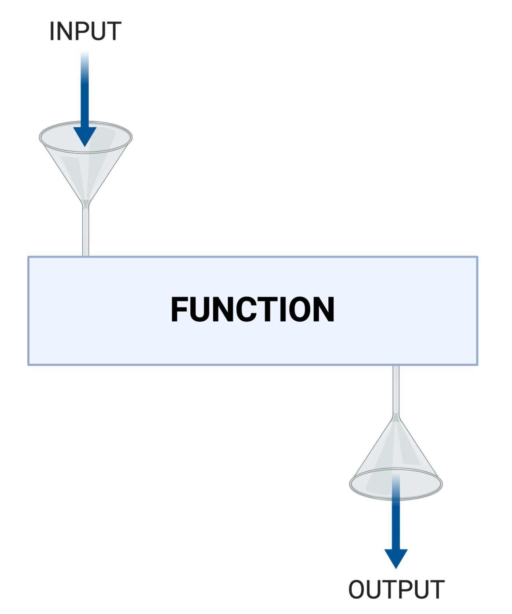
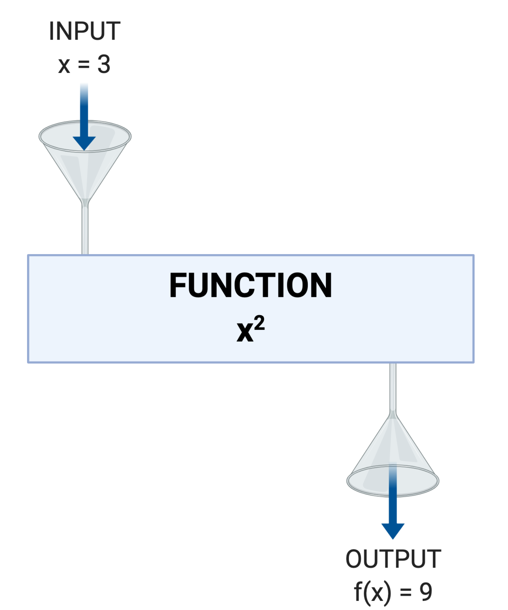
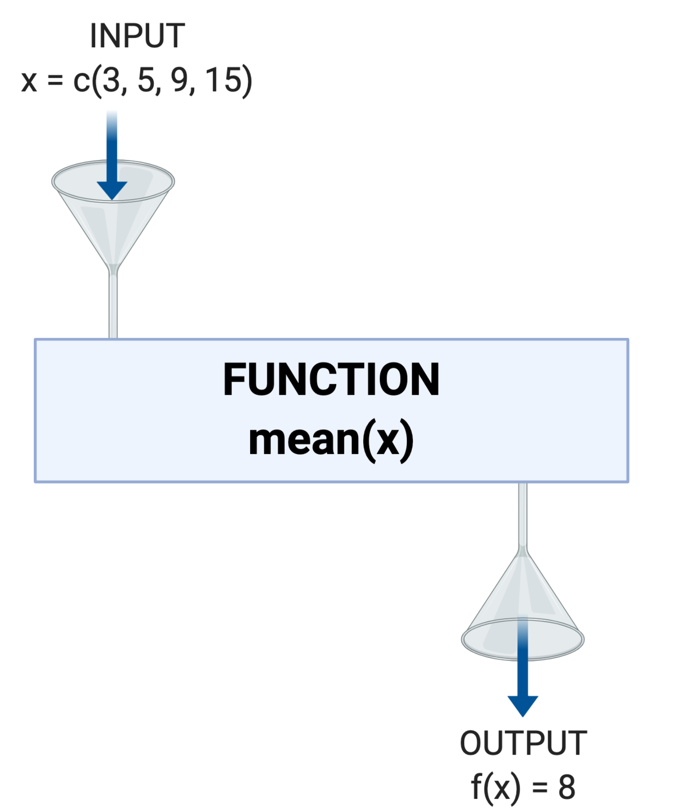
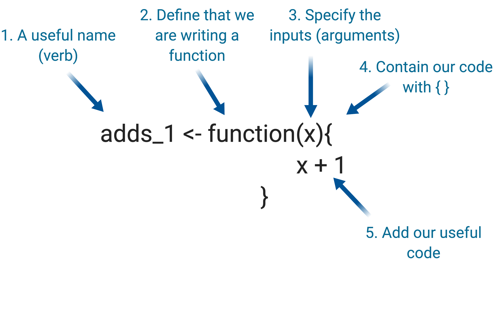

```{r xaringan-themer, include = FALSE}
library(xaringanthemer)
mono_accent(
  base_color = "#67001f",
  header_font_google = google_font("Josefin Sans"),
  text_font_google   = google_font("Montserrat", "300", "300i"),
  code_font_google   = google_font("IBM Plex Mono")
)
```

#Outline

###1. Functions
###2. Iteration and Loop Functions 
###3. Conditional Statements

---

layout: false
class: inverse, middle, center

#Functions

---

#What is a function?

.pull-left[

- ####A function is a reusable piece of code that does a specific task
]

.pull-right[

]

---
#What is a function?

.pull-left[
- ####A function is a reusable piece of code that does a specific task
]

.pull-right[

]

---
#R has built in functions 
.pull-left[
- ####Schematic

]

.pull-right[
- ####R code

```{r}
#input
x <- c(3,5,9,15)


#function
mean(x)
```
]

---

#Functions take arguments
.pull-left[
- #### Function inputs are called arguments
- #### ```mean()``` has 3 arguments
- #### ```?mean``` to view arguments
- #### Arguments can be specified by *order* or *name*
]

.pull-right[

```{r, eval = FALSE}
x # a numeric vector

trim # fractions of outliers
     # you would like to
     # trim from each end 

na.rm # option to remove
      # missing values
```

]

---

# Packages also contain functions 

```{r, fig.width=5, fig.height=5}
library(ggplot2)
ggplot(data = mtcars, aes(x = as.factor(cyl), y = mpg))+
  geom_boxplot()+
  xlab("cyl")
```

---

#Function Syntax

A function is defined as follows:
```{r, eval = FALSE}
add_1 <- function(x){
  x + 1
}
```

We can break this down into: 

+ The **signature** (the user interface)
```{r, eval = FALSE}
add_1 <- function(x)
```

+ The **body** (the code the function executes)
```{r, eval = FALSE}
{
  x + 1
}
```

---

#3 Reasons to write functions

###1. Code becomes easier to read & understand

Functions have evocative names e.g. mean(), sum(), sd()

###2. Code becomes easier to change

add_1 <- function(x){x + 1} can easily become 
add_2 <- function(x){x + 2}

###3. Less mistakes

No copy and pasting chunks of code

---

layout: false
class: inverse, middle, center

#"You should consider writing a function whenever you've copied and pasted a block of code more than twice"
.right[Hadley Wickham]

---

#Writing your own function (Step by Step) 

 

---

# Embedding Functions

This code:
```{r, eval = FALSE}
exp_1 <- read.csv("exp_1_data.csv") #import
exp_1_filtered <- filter(exp1, value < 10) #filter
```

Can be wrapped into a function:
```{r, eval = FALSE}
#write a function to import and filter data
import_and_filter <- function(path_to_file){
  
  x <- read.csv(path_to_file) #import
  x <- filter(x, value < 10) #filter
  return(x)
}
```

Now we can repeat for lots of experiments:
```{r, eval = FALSE}
#Use function
exp_1 <- import_and_filter("exp_1_data.csv")
exp_2 <- import_and_filter("exp_2_data.csv")
exp_3 <- import_and_filter("exp_3_data.csv")
```

---
# Exercise 1

+ Write your own function that multiplies the input by 10 

--

+ Answer

```{r, eval = FALSE}
times10 <- function(x){
  10*x
}
```

---
#Documentation

+ Documentation is essential, even if the only person reading your code will be you in the future
+ Check help for any function for the best examples (?mean)

```{r, eval = FALSE}
#multiplies the input by ten
#input must be numeric
times10 <- function(x){
  10*x
}
```

---

#Exercise 2

+ Embed the following functions in your own function

```{r, eval = FALSE}
my_data <- read.csv("my_csv_file.csv")
my_processed_data <- mutate(my_data, total = sum)
```

--
+ Answer

```{r, eval = FALSE}
input_and_process <- function(my_csv_file){
  my_data <- read.csv(my_csv_file)
  my_processed_data <- mutate(my_data, total = sum(my_column))
  return(my_processed_data)
}
```

---

layout: false
class: inverse, middle, center

#Iteration and Loop Functions

---

#Iteration 

#### Like functions, iteration is  another tool to ***reduce duplication*** in your code, resulting in code that is ***easier to read*** with ***reducing mistakes***.

Some main tools to iterate in R are: 
+ **Loops** (a good way to learn iteration)
+ **Loop functions** -  (more efficient) like *apply family statements* (behind-the-scenes looping in base) OR the *purr package* (behind-the-scenes looping using the Tidyverse)

--

Here we will focus on Looping and apply statements. Take a look at the Purr package from Hadley Wickham in your own time. 

---

#For Loops

Say we want to calculate the mean of every column in a dataframe (we will use the mtcars dataframe as an example:)
```{r}
head(mtcars, 3)
```

We could calculate each mean one by one, like this:
```{r, eval = F}
mean(mtcars$mpg) #20.09062
mean(mtcars$cyl) #6.1875
mean(mtcars$disp) #230.7219
# ...etc ...
```
  
---
# For Loops
A better (think ***less errors*** and ***easier to read***) approach is to use a ***For Loop***

```{r}
mtcars_means <- vector(length = ncol(mtcars))  # 1. Define Output

for (i in seq_along(mtcars)) {                 # 2. Define Sequence
  mtcars_means[[i]] <- mean(mtcars[[i]])       # 3. Define Body
}

mtcars_means
```

---

# Loops have 3 parts:

+ Before you start the loop, you must define a container for the output. An good way to do this is to create an empty vector the same length as our dataframe we want to iterate through:
```{r, eval = F}
mtcars_means <- vector(length = ncol(mtcars))  # 1. Define Output
```

+ We then define what to iterate/loop through. Each pass of the loop will assign *i* to a different value from seq_along(mtcars) - in this case each value of *i* is a column of mtcars:
```{r, eval = F}
for (i in seq_along(mtcars)) # 2. Define sequence
```

+ The body is the code that we want to execute for every value of *i*. It is run repeatedly, in this case for each column of mtcars: 

```{r, eval = F}
mtcars_means[[i]] <- mean(mtcars[[i]])
```

---

#Exercise 3
+ Write a for loop to calculate the median of every column in the USArrests dataset

--

+ Answer
```{r}
USArrests_medians <- vector(length = ncol(USArrests))# 1. Define Output

for (i in seq_along(USArrests)) {                    # 2. Define Sequence
  USArrests_medians[[i]] <- median(USArrests[[i]])   # 3. Define Body
}

USArrests_medians

```

---

#Loop Functions 

+ Apply functions are **more efficient** than for loops, particularly when working with big data. 
+ The apply family contains lots of functions - *apply(), sapply(), lapply(), tapply() and mapply()*
+ They loop over different structures in R and generate a different structured outputs. 
+ Here, we will look at **apply()** which loops over arrays/matrixes and **lapply**, which loops over lists. 
---

#apply()

```{r, eval = F}
apply(X, MARGIN, FUN, ...)
```

+ Loops over an array or matrix (X). 1 = rows and 2 = columns
+ Can loop over columns or rows with the MARGIN argument 
+ Specify a function (FUN) that you want to apply to the data. It can be any function in R (like mean()) or a user definied function. 

We can use apply to calculate the mean of all columns in the mtcars dataframe like this: 
```{r}
my_means <- apply(mtcars, 2, mean)
my_means
```

---
#lapply()

```{r, eval = F}
lapply(X, FUN, ...)
```

+ loops over elements in a list (X) and return a list
+ Specify a function (FUN) that you want to apply to the data. It can be any function in R (like mean()) or a user defined function. 
+ Returns a list of length X which is the result of the function applied to each element of X

```{r}
mtcars_list <- as.list(mtcars) # turn mtcars into a list for demonstration

my_means <- lapply(mtcars_list, mean)
head(my_means, 2) 
```

---
#Exercise 4

+ Use an apply family function to calculate the sum of each of the columns in the mtcars dataset

--

+ Answer

```{r}
mtcars_sums <- apply(mtcars, 2, sum)
mtcars_sums
```

---

layout: false
class: inverse, middle, center

#Conditional Statements

---
# If Statements

If Statements are conditional statements in R. In an If Statement, we define code to be executed **if** certain conditions are met

```{r}
x <- 5

if(x > 0){                      # 1. Define Condition
    print("Positive Number")    # 2. Define Body
}
```

---
# If...Else Statements

But what if x < 0 

```{r}
x <- -4

if(x > 0){                      # 1. Define Condition
    print("Positive Number")    # 2. Define Body
}
```

--

+ Nothing happens... unless we add else

```{r}
x <- -4

if(x > 0){                      # 1. Define Condition
    print("Positive Number")    # 2. Define Body
} else {
  print("Negative Number")
}
```

---

#Side Note: ifelse() is a fast alternative

+ For simple cases, we can use the base R function ifelse() instead

```{r}
x <- 5

my_test <- ifelse(test = x>0, 
                  yes = print("Positive Number"), 
                  no = print("Negative Number"))
#This means: if x > 0 , 
#            then print "Positive Number", 
#            or if not print "Negative Number"

my_test
```

---
#Exercise 5

```{r}
x <- 10
y <- 5
```

+ Define an condition statement that prints "x times y is big" if x*y > 10

--

+ Answer

```{r}

if(x*y > 10){
  print("x times y is big")
}

```

---
#Exercise 5

+ Redefine x and y as follows:
```{r}
x <- 0.8
y <- 2
```

+ Add a useful else... condition to our if else statement from before

--

+ Answer

```{r}

if(x*y > 10){
  print("x times y is big")
} else {
  print("x times y is small")
}

```

---

#Exercise 6

```{r}
x <- c(3,-4,6,-9)
```

+ Using a For Loop, iterate through the vector x and print whether each value is positive or negative

--

+ Answer

```{r}

my_answers <- vector(mode = "character", length = length(x))

for (i in seq_along(x)){

  if(x[i] > 0){
    my_answers[i] = "X is positive"
  } else {
    my_answers[i] = "X is negative"
  }
}

my_answers
```

---

#Acknowledgements: 

- Some material used in this presentation has been modified from https://r4ds.had.co.nz/
- Slides created via the R package **xaringan** 
- Theme created with the R package **xaringanthemer**
- Help has come from **remark.js**, **knitr**, and **R Markdown**.


